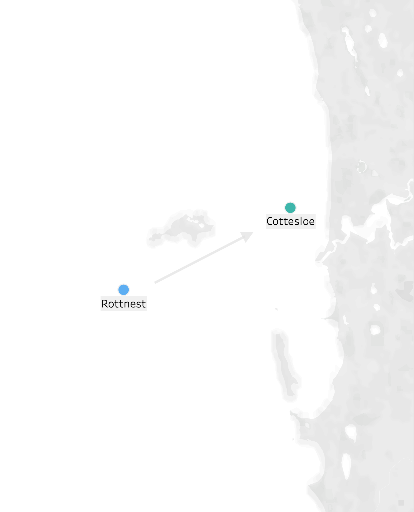

# Predicting nearshore wave conditions given high-level offshore wave summary statistics

This repository hosts works pertaining to a 2020 Data Science Capstone project, undertaken by:

- Johnny Barrett
- Jason Veljanoski
- Ammar Pervez
- Yajun Zhou
- Teggs Lou

The primary aim of this project is to explore the extent to which near-shore wave statistics can be predicted from high-level wave summary data recorded at an off-shore location. Existing numerical and physics-based models that are purpose-built for this task are incredibly computationally intensive, opening an opportunity for modern machine learning algorithms to make this process sig- nificantly more efficient and/or portable. Rather than operating on prohibitively large amounts of physical movement or spectral data, as the classical techniques do, the machine learning methods applied in this paper are only supplied with three high-level wave statistics, namely Significant Wave Height, Peak Wave Period and Primary Swell Direction. These data are in the form of a time-series, with recordings from two separate wave buoys off the coast of Perth, Western Aus- tralia, located at Rottnest and Cottesloe beach.

## In this repository

### process

Code and documentation for transforming MATLAB data into suitable flat file format appropriate for machine learning algorithms.

### ml

Exploratory data analysis, feature engineering and machine learning notebooks, each focusing on the prediction of a particular wave statistic.

### app

Documentation, setup instructions and code for a web application that provides a user interface for interaction and exploration of the developed models.

___

